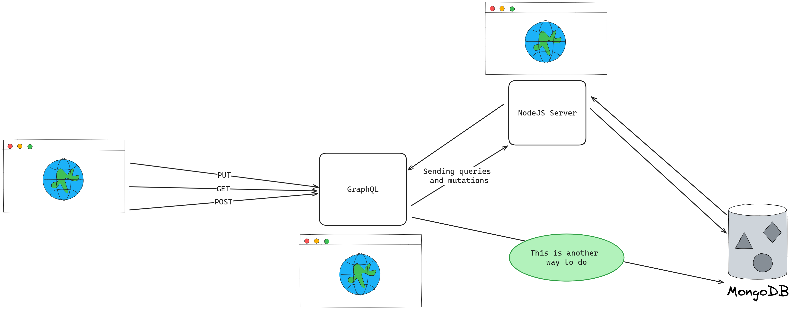

# Cautious Lamp

## Description

Cautious Lamp is a simple task management server that demonstrates the use of GraphQL with NodeJS and MongoDB. It allows users to authenticate with email and password using JWT.

## Overview

Client applications can interact with the server using GraphQL queries and mutations. The server uses MongoDB to store data.

The architecture of the server is as follows:



While these technologies are much complex than what should be used for a simple task management server, they are used to demonstrate that GraphQL is designed to work with any backend technology. The server can be easily modified to use other technologies such as MySQL, PostgreSQL, etc. for data storage.

## Features

### Task Management

| Feature | Description |
| --- | --- |
| Task prioritization | Assign a priority to a task and sort tasks by priority |
| Task deadline | Assign a deadline to a task and sort tasks by deadline |
| Task category | Organize tasks by category (e.g. work, personal, etc.) and filter tasks by category |
| Search functionality | Search for tasks by title, description, category, etc. |
| Task notes | Add notes to tasks |
| Task steps | Break down tasks into smaller steps and track progress of a task by tracking progress of its steps |
| Collaborate on tasks | Users on the same team can view and edit each other's tasks |
| Archive tasks | Archive tasks |
| Task attachment | Attach files to tasks (in progress) |

### Project and Theme Management

| Feature | Description |
| --- | --- |
| Add and remove members | Members can be added to a project or theme. Manager can also be changed. |
| Add and remove project's tasks | Since the project can have multiple tasks and themes at the same time |
| Add and remove project's themes | |
| View project's tasks and themes' tasks | |

## Setup

1. Install required packages and create a config.env file in backend folder:

    ```bash
    cd backend
    npm install
    touch config.env
    ```

    Then add the following to the file:

    ```bash
    NODE_ENV=dev
    PORT=3000
    DATABASE=<your-mongodb-database-url>
    DATABASE_PASSWORD=<your-mongodb-database-password>
    JWT_SECRET=<your-jwt-secret> # e.g. do-this-later-in-case-you-forgot
    JWT_EXPIRES_IN=<your-jwt-expiration-time> # e.g. 90d
    ```

2. Install required packages and create a config.env file in graphql folder:

    ```bash
    cd graphql
    npm install
    touch config.env
    ```

    Then add the following to the file:

    ```bash
    NODE_ENV="dev"
    PORT=4000
    BASE_URL="http://localhost:3000/"
    ```

3. Start the server:

    ```bash
    cd backend
    npm run start:dev
    ```

4. Start the graphql server:

    ```bash
    cd graphql
    npm run start:dev
    ```